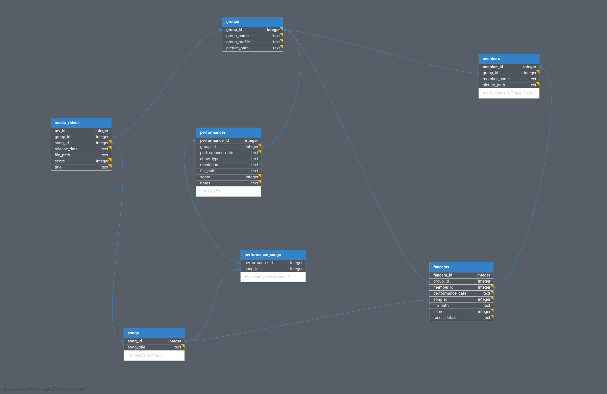

# My Kpop Performance Database Project

This project is my journey into learning Computer Science by building a database and application to manage Kpop performance information.

## Database Schema

The structure of the database is outlined in the Entity-Relationship Diagram below:

The corresponding SQLite script to create this schema can be found at `./database/schema.sql`.

## Mounting External Shares

The multimedia files managed by the `kpop_performance_database` are intended to be stored on USB drives connected to a Windows PC. However, the main application currently runs on an Ubuntu machine (a Windows version is planned for the future).

To make these Windows shares accessible from Ubuntu, a mounting script is provided:

*   **Script:** `mount_windows_shares_a.sh`
*   **Credentials:** This script requires a `.smbcredentials` file containing the username and password for the Windows share.
    *   An example file (`.smbcredentials_example.txt`) is included in the repository.
    *   **Important:** Copy `.smbcredentials.example` to `.smbcredentials`, fill in your actual private credentials, and **ensure `.smbcredentials` is added to your `.gitignore` file** to prevent committing sensitive data.
*   **Execution:** You can typically run the script using `bash ./mount_windows_shares_a.sh` (you might need `sudo` depending on your mount point and permissions).
*   **Prerequisites:** You may need to install `cifs-utils` on Ubuntu: `sudo apt update && sudo apt install cifs-utils`
*   **More Information can be found in the file `mount_windows_shares.info_a.txt`.
